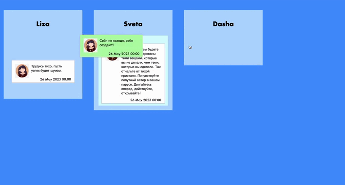

# drag-drop-tasks-widget


Пользователь может выбрать перетаскиваемые элементы с помощью мыши, перетащить эти элементы в перетаскиваемый элемент и сбрасывать их, отпустив кнопку мыши. 
Реализованный функционал:
* дропируемые контейнеры с перетаскиваемые элементами по вертикали
* перемещение элементов между столбцами

### Перед запуском необходимо установить react-beautiful-dnd:

```
npm install react-beautiful-dnd
```

### Запуск проекта:

```
npm start
```